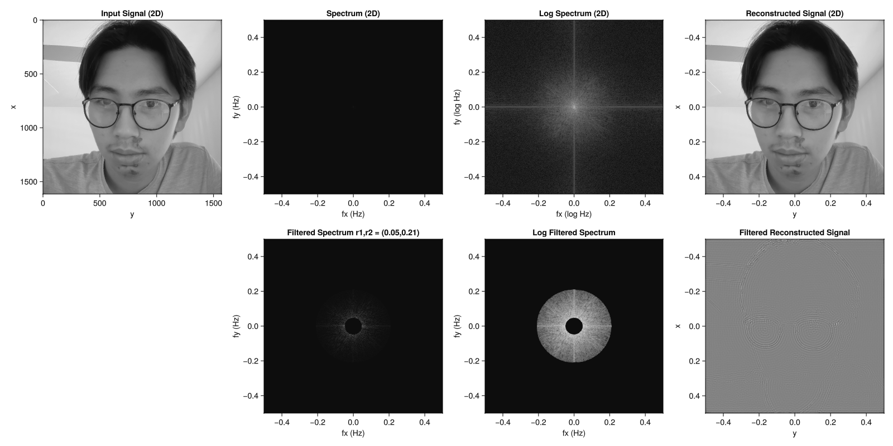

# FFT Shift and Reverse

I was bored and want to relearn FFT while on bedrest after and ER visit. Back in undergrad, Dr. van Howe from my Intro to ElectroMagnitism class did a lecture on Fourier Transform. I remember he showed the class the animation of the different wave going from the smallest order to the largest order can reconstruct an image.

Currently this repository is for to explore how to redo that animation I saw 4 years ago.

I also got inspired by [j2kun python repository on fft](https://github.com/j2kun/fft-watermark), but this will be in Julia.

## First iteration 
I got to the part where the filtering of spectum can reconstruct the image in an edge detection case. 
Here is the animation for that

>I used an input image that converted to gray scale. That is(was) me on my 6th day of recovery after face planted on a side walk.

## Finally
We finally got there when sorting the magnitude of the FFT and plot it 

You can see the attempt in mag_fft2d.jl